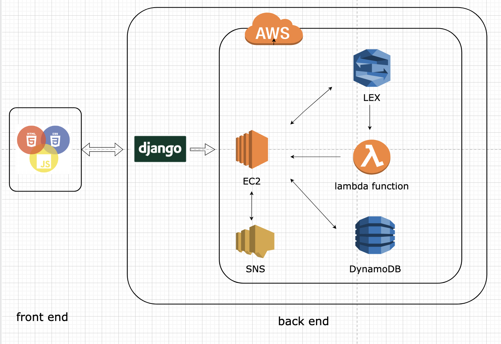

# hackathon--alpharetta

Tech Alpharetta Women’s Forum is to advance opportunities for females working in STEM careers, by offering networking, educational and mentoring events in local community.

The goal of this project is to provide a platform demo of user registration, mentor-mentee matching, and appointment scheduling for Tech Alpharetta.

https://github.com/Qi1122/hackathon--alpharetta/blob/main/backend-architecture-diagram.png?raw=true